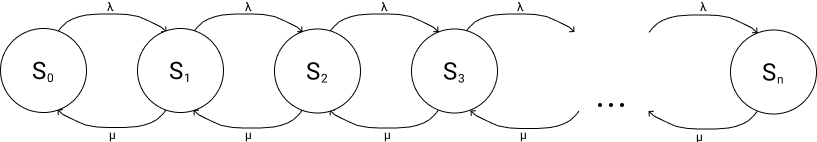

# Single-channel queuing system 
Educational and technological practice on modeling a single-channel queuing system for practicing skills in the course of Object-oriented programming and Queuing Theory by a student of the Bauman Moscow State Technical University of the CAD Systems Department

## Links
+ [Theory](docs/theory.md)
+ [Build and launch](docs/launch.md)

## Task
It is required to develop a program that implements discrete-event modeling of the system: 
+ Let's simulate the behavior of a customer in a store where there are 2 cash registers, and a separate queue is built for each of them, and the qualifications of employees are slightly different, so the service time is distributed with different parameters. Each cash register will be represented by a single-channel device, which will be accessed by numbers. Queues will also be identified by numbers, without introducing symbolic names. The simulation will be carried out for 1 hour, we will choose a second as the unit of time. 
  - The time between the arrival of buyers is distributed on the segment [0; 25]. The service time at the first checkout is distributed over the segment [11;25]. The service time at the second cash register is distributed over the segment [9;25].
  - When making a decision, the buyer first checks whether there is a free cash register, and, if there is, goes to it. 
  - If both cashiers are busy, then selects the cashier whose queue is shorter at the moment. 
  - If both cash registers are free, or the queue for them is the same, then the first cash register is selected.
Note that all time intervals obey the laws of distributions, which are continuous in nature. Therefore, the choice of integer data types for moments and time intervals, and especially the increment of model time with a single step, is categorically incorrect. It is necessary to implement the transition from event to event, as it is done in GPSS and other problem-oriented systems. To simplify, we can limit ourselves to using a single stream of random numbers to generate all the necessary random variables. The result of the program should be a log file containing entries of the type: 
+ "At time 12.345, a transaction with ID 1 entered the model", 
+ "At time 123.456, a transaction with ID 123 entered queue 1", 
+ "At time 234.567, a transaction with ID 234 occupied device 2",
+ "At time 345.678, a transaction with ID 345 released device 1", 
+ "At time 456.789, a transaction with ID 456 exited the model."

## Result

## Assigning project directories:
+ `docs` - documentation files
+ `include` - header files
+ `src` - .cpp files

## The algorithm of the program
The program provides 2 chains: a chain of current events (CEC) and a chain of future events (FEC), which will be filled in and changed in the future. Initially, there will be a transaction in the chain of future events that has a zero ID and its execution time is the full simulation time. The program sequentially performs 3 stages (or phases):
* the 1st stage is the input phase: here transactions are added to the FEC and waiting for their turn
* 2nd stage - timer correction phase: here transactions with minimal time are moved from CEC to FEC
* the 3rd stage is the viewing phase: here the transactions either change their position in the model (moves in turn, goes to the service device), or exits the model.
